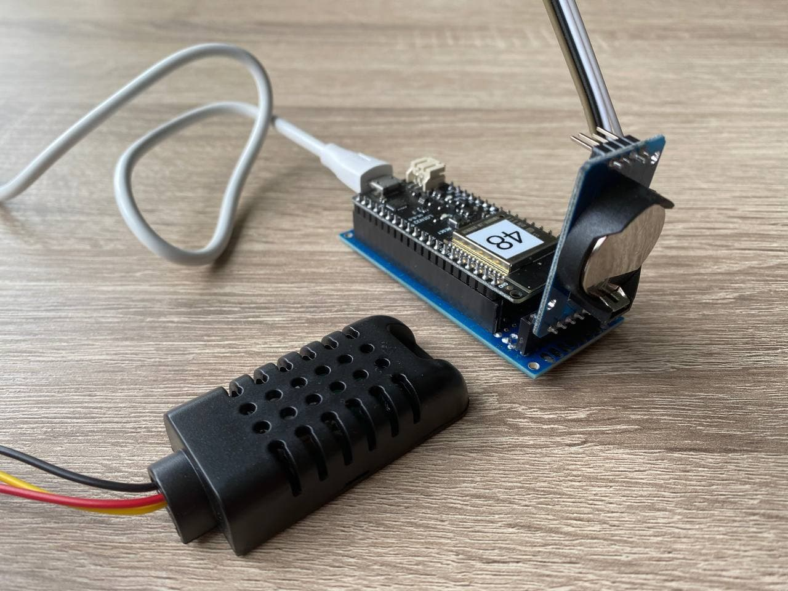

## UT_ESP32DHT_logger

Author: Harmen Hoek  
Date: 11-05-2021 
For: Physics of Complex Fluids group, University of Twente

### About
This project is for a USB DHT22 temperature & humidity logger for Windows. 

### How to use
1. Install the CP210x from Silabs serial drivers for the ESP32 (https://www.silabs.com/developers/usb-to-uart-bridge-vcp-drivers).
2. Connect the ESP32 with DHT sensor, and lookup the COM port in Windows Device Manager.
3. Download dist/UT_ESP32DHT_logger.exe
4. Run the program.

### In-depth

#### Electronics
ESP32 (LONIN32 v1.0.0) with DHT22 sensor (INPUT 4), and ZS-042 (rtc, SCL/SDA) for timekeeping.

#### ESP32 firmware
Once powered via USB, the ESP sets up a Serial connection (115200). When WiFi is available (hardcoded SSID and password), it connects and obtains current epoch from NTPClient and sets the RTC with this time. If no WiFi is available it uses the saved datetime from the RTC. If RTC experienced power loss (battery removal) it sets the current datetime to the ESP compile datetime (thus inaccurate).
The DHT sensor is started, and prints a datetime,temp,hum every 3 seconds.

Requires DHT22 library (by Adafruit, v1.4.1), RTClib library (by Adafruit, v1.13.0), WiFi library (by Arduino v1.2.7) and TinyWireM library (by Adafruit, v1.1.0).

#### Python
The Python code asks for the COM port where the ESP32 is connected to and starts reading out the serial port. Data is printed to screen and to a log-file (in same directory, with unique datetime stamp).

Code is compiled to an executable using pyinstaller. (`pyinstaller UT_ESP32DHT_logger.py --onefile`)

Requires pyserial (v3.5) and pyinstaller (v4.3).